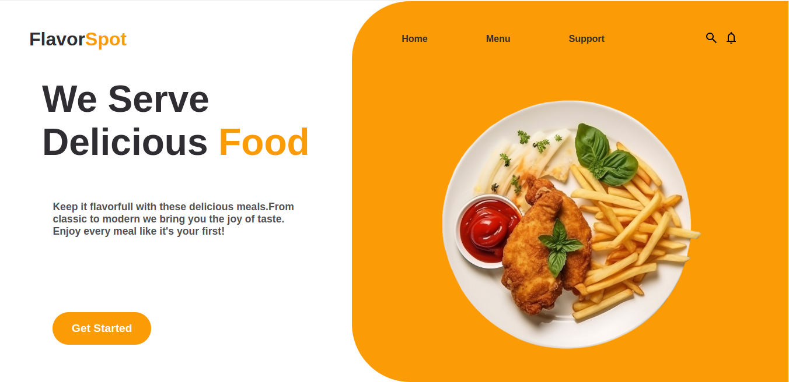
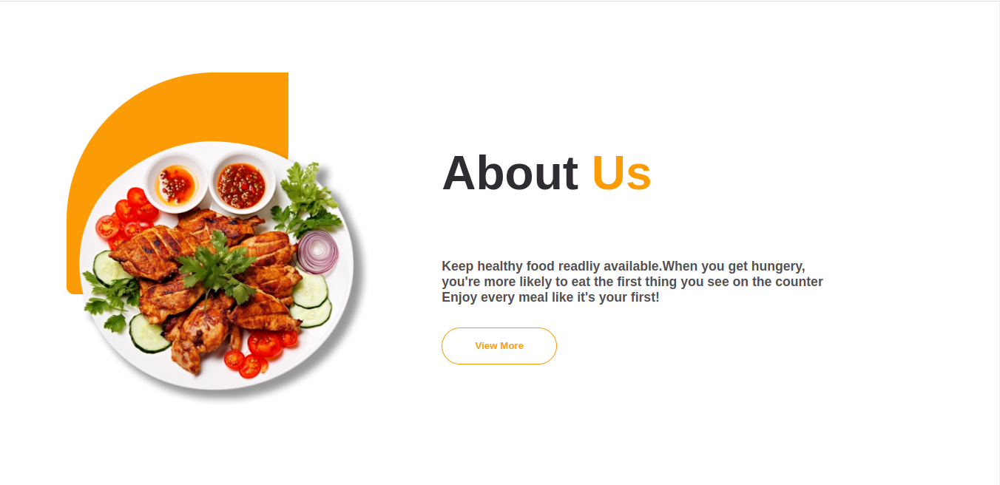
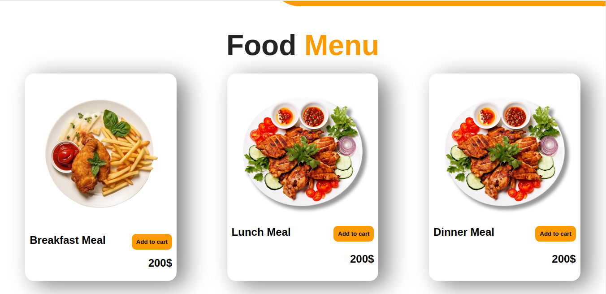

# FlavorSpot
-this resturant website is part of the odin project course!

## Home page

## About section

## Menu

## What i learned:
-this is the first project i build using ES6 modules

-learned the basic foundations of webpack and how to bundle files

-got more familiar with npm and how to manage packages

-got more familiar with npm scripts and how to automate certain tasks

-got more grasp on project directory structure and code organization

-got the design idea from https://www.behance.net/gallery/107490815/Food-Landing-Page
